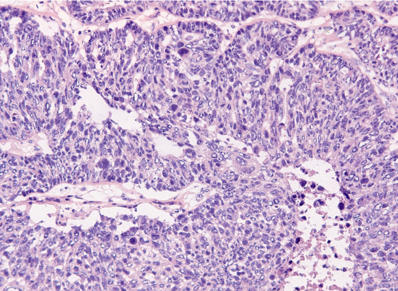

# Evaluating the Accuracy of a Predicitive Cancer Test

## Overview

The purpose of this project is to create a tool that can help pathologists predict which biopsy samples tested by a neural network-based diagnostic test are likely to have received a false positive or a false negative result, thereby increasing the diagnostic efficacy of the test.

The Peter MacCallum Cancer Centre uses a test from SOPHIA Genetics to test biopsy samples to determine whether patients with ovarian cancer will respond to a particular drug therapy. The test looks for ‘genomic instability’, which is where there are multiple breaks in the DNA sequence. If this feature (or 'phenotype') is seen in ovarian cancer genomes, it is a positive predictive biomarker for treatment with new drugs (i.e. such patients are likely to do better than if treated with standard drugs).

BRCA1 and BRCA2 are genes that encode proteins that help repair damaged DNA. Everyone has two copies of each of these genes—one copy inherited from each parent. BRCA1 and BRCA2 are called tumor suppressor genes because when they stop functioning, usually due to harmful (or pathogenic) variants (or mutations), tumours may develop.

Some people have a genetic predisposition to ovarian (and breast) cancer because they have already inherited a pathogenic BRCA1 or BRCA2 variant from one parent. Although they would have also inherited a normal copy of that gene from the other parent (because embryos inheriting two harmful variants cannot develop), the normal copy can be lost or changed in some cells in the body during the person’s lifetime. Cells that lose their remaining functioning BRCA1 or BRCA2 genes can grow out of control and become cancer.

In ovarian cancer, the cancerous cells will often have multiple breaks in their DNA (genomic instability) because BRCA1 or BRCA2 is no longer functional. Patients with this 'phenotype' are likely to respond well to a particular drug therapy that inhibits backup DNA repair processes, resulting in cancer cell death. This drug is prescribed once a patient is in remission and helps control future tumor growth. The drug has the advantage of having fewer side-effects than other cancer treatments available.

The ’gold standard’ test for genetic instability is the Myriad Genetics myChoice test; however, this is not available in Australia. An alternative, the SOPHIA Genetics test, uses a machine learning model trained to detect genomic instability within cancer genomes. This model has high accuracy compared to Myriad (approximately 95%) however, false negatives and false positives remain an issue and have serious consequences for the patients – whether being prescribed a drug that is ineffective (false positive) or not receiving a drug when it is suitable (false negative). 

We have been supplied training data from the Peter MacCallum Cancer Centre. This is a series of test results from 139 cases, with corresponding Myriad and SOPHIA results. The data includes many independent variables for training a model.

Two approaches have been taken: development of a neural network using TensorFlow, creating a binary classification model that can predict which SOPHIA genomic instability results may be misclassifications; alternatively, given the limited number of results and the high risk of a neural network becoming overfitted, a Random Forest model to achieve the same prediction.

## Features

The complete list of features obtained for model training is listed below.

| Heading | Description |
| ---------- | ---------- |
| Run | Nominal value describing a batch of samples analysed together. Maximum number of samples in a run is 24. Each run has an associated SeqRunID. |
| SampleID | Unique laboratory identifier for a sample (i.e a tumour or 'specimen'). |
| Source | Original provider of the specimen. AZ = AstraZeneca, WEHI = Walter & Eliza Hall Institute, Greece = Genotypos, Athens, Brazil = DASA, Sao Paulo. |
| MonthsOld | Age of specimen in months from collection date to receipt by Peter Mac (if known). |
| Purity | Microscopy-based estimate of percentage of tumour cells in the specimen. Indicates the amount of contaminating normal cells in the specimen. |
| SeqRunID | Analyser generated identifier for each batch of analyses. |
| DDMSampleID | Bioinformatic pipeline generated unique identifier for each sample. One to one correspondence with SampleID. |
| MIDS | Bioinformatic pipeline generated multiplex identifier. Unique within each run. Same as suffix of DDMSampleID. Useful to define sort order of samples within each batch. |
| TotalReads(M) | Total number of sequence reads associated with the sample.. Sum of lpWGS reads and Target Panel reads |
| lpWGSReads(M) | Sequence reads scattered randomly across the genome at low fold coverage - 1x or less ('low pass'), meaning the average number of reads covering any base pair is at most one. |
| TargetPanelReads(M) | Sequence reads over genes of interest (BRCA1 and BRCA2). High fold coverage (100x minimum fold coverage per base pair) over these regions of the genome is achieved by molecular enrichment technique called hybridisation capture |
| %ReadslpWGS | Percentage of Total reads that are lpWGS reads. Usually about 65% |
| %ReadsPanel | Percentage of Total reads that are targeted to genes. Usually about 35% |
| 1000x | Percentage of base pair positions in Target Panel regions (not lpWGS regions) that get >1000x unique coverage |
| 500x | Percentage of base pair positions in Target Panel regions (not lpWGS regions) that get >500x unique coverage  |
| 200x | Percentage of base pair positions in Target Panel regions (not lpWGS regions) that get >200x unique coverage  |
| 100x | Percentage of base pair positions in Target Panel regions (not lpWGS regions) that get >100x unique coverage  |
| 50x | Percentage of base pair positions in Target Panel regions (not lpWGS regions) that get >50x unique coverage  |
| 25x | Percentage of base pair positions in Target Panel regions (not lpWGS regions) that get >25x unique coverage  |
| DupFrac | Fraction of all reads that are duplicates of each other (based on their mapped position on reference genome). Duplicates arise from PCR amplification of the sample. Duplicate reads are bioinformatically removed before coverage is calculated i.e. coverage is calculated for 'unique' reads |
| LowCovRegions | The number of regions with the Target Panel where coverage goes below 100x unique reads. A high value indicates a poor sample or analysis |
| PurityPloidyRatio | Ratio between tumour content and local number of chromosomal regions (ploidy), estimated from the strength of the copy number signal seen in the assay. |
| ResNoise | Standard deviation of the normalized lpWGS coverage profile with respect to the smoothed lpWGS coverage profile |
| SignalNoiseRatio | Strength of the signal induced in the normalized lpWGS coverage profile by all copy number aberrations present in the sample divided by the residual noise |
| QAStatus | High : quality is sufficient to compute GI index. Medium: quality is lower and ML algorithm may not succeed in computing GI index. Low: quality too low to compute a GI index. |
| Gene | Name of gene in which any mutation was detected by the Targeted Panel (either BRCA1 or BRCA2) |
| Variant | Standardised nomenclature describing the mutation and its effect on the affected gene/protein |
| %VariantFraction | Fraction of reads supporting the variant as a percentage of all reads covering the mutated position |
| MyriadGIScore | The Genomic Instability score determined for the sample using the Myriad Genetics myChoice HRD assay, an FDA approved measure of HRD as a biomarker. This is the Reference Method ('Gold Standard', or source of truth in determining the accuracy of the SOPHiA method). Range from 1 to 100, a value greater than 42 corresponds to genomically unstable (HRD positive) |
| MyriadGIStatus | 1 = HRD Positive 2 = HRD Negative |
| SOPHiAGIIndex | The Genomic Instability Index for the method being validated - the SOPHiA Genetics HRD assay. Range form -20 to 20, a value greater than 0 corresponds to genomically unstable |
| SophiaGIStatus | 1 = HRD Positive, 2 = HRD Negative, 3 = Inconclusive, 4 = Rejected |

<h2>Preparation and Cleaning of Data</h2>
<li>Python code was used to organise and preprocess data for further analysis and storage. The code - <i>PeterMac_extract_merge_pdf_gi_qa_stats.ipynb</i> and <i>PeterMac_HRD_clinical_data.ipynb</i> - processed and transformed data from multiple PDF and CSV files, merged them based on specific columns, and applied various calculations and data cleaning operations. The final DataFrame was saved as a CSV file. In particular:</li><ul>
<li>Searched for specific CSV files in the source folder using glob. </li>
<li>Merges DataFrames based on specific columns using the pd.merge function. </li>
<li>Merges two DataFrames based on specific columns. </li>
<li>Removes entries not related to the BRCA1 or BRCA2 genes. </li>
<li>Calculates the age of samples and drops unnecessary columns. </li></ul>
The processed test data is stored in MongoDB database as the <i>sofia_test_model</i> document, in the <i>python_db_processed_data.ipynb</i> collection.
 <h2>Preprocessing the data for the model</h2>

Data preprocessing performing data cleaning and transformation steps to prepare the dataset for machine learning using the pandas library in Python in summary:

<li><b>Drop Unnecessary Columns: :</b>  Drops specific columns like "SampleID", "SeqRunID", and "DDMSampleID" that are not beneficial for the analysis. </li>
<li><b>Convert Data Types: :</b>  Converts columns like "MonthsOld" and "Purity" to numeric data types for further analysis. It handles missing values by converting them to zeros. </li>
<li><b>Create Non-agreement Column: :</b>  Creates a new column "Non_agreement" which represents the absolute difference between "SophiaGIStatus" and "MyriadGIStatus".</li>
<li><b>Clean Numeric Columns: :</b> Replaces missing values (represented as '-') in columns like "PurityPloidyRatio", "ResNoise", and "SignalNoiseRatio" with zeros. Handles '.' values in "Purity" and "%VariantFraction" by converting them to zeros. </li>
<li><b>Label Encoding: :</b>  Applies label encoding to the "Variant" column, converting categorical values into numerical representations. </li>
<li><b>Grouping and Binning: :</b>  Groups data and calculates counts for columns like "QAStatus", "Gene", "Variant", and "PurityPloidyRatio".</li>
<li><b>One-Hot Encoding:</b> Performs one-hot encoding on categorical columns like "QAStatus", "Gene", "Variant", and "Source", creating binary columns for each unique value. This expands the categorical columns into a more suitable format for machine learning algorithms. </li>

<li>Neural Network</li>

The purpose of a neural network is to approximate complex, non-linear relationships between inputs and outputs in data with the result that they can automatically learn patterns and representations from the data, allowing them to make predictions or decisions based on new, unseen data.

A neural network was proposed and tried in this exercise as it can produce a high level of accuracy. In order to build this model we used the Tensor Flow library.

<h3>Steps taken within the code:</h3><ul>
<li>main_process Function</li><ul>
<li>The main_process function is the core of the training process. It takes several arguments, including a callback, scaled training data, target data, neural network model, and a report interval. It trains the model using the provided data, runs for a set number of epochs, and reports loss and accuracy at specified intervals.</li></ul>
<li>Optimisation</li><ul>
<li>The data is optimised before feeding it into the neural network. This involves handling missing values and performing feature scaling. </li></ul>
<li>Principal Component Analysis (PCA) </li><ul>
<li>This section involves performing Principal Component Analysis (PCA) on the dataset. PCA is a dimensionality reduction technique. The code splits the data into training and testing sets, applies PCA to the training data, and transforms the testing data accordingly. It then creates new DataFrames for the PCA-transformed data. </li></ul>
<li>Data Scaling</li><ul>
<li>The code uses the StandardScaler from scikit-learn to scale the data before training the neural network. Scaling is important for ensuring that features are on a similar scale, which can improve convergence during training. </li></ul>
<li>Callback Functions</li><ul>
<li>It is important for the model to output its test results to ensure that they can be retrieved and examined as the model is developed and tuned.  This model is intended to provide a quality control test concerning whether patients will respond to a specific drug regime, hence its results need to be available for inspection. </li>
<li>To achieve this two call back functions have been developed: <b>final_callback</b> and <b>loss_accuracy_callback</b>. The final_callback function prints a message passed to it, and the loss_accuracy_callback function prints loss and accuracy information for each epoch during training. This is then output into JSON and / or csv files for storage in a database. </li></ul></ul>
<h2>Optimisation and parameters:</h2>

<li>A number of models were run with different combinations of hyperparameters. For the purposes of this project the hyperparameters chosen were the number of nodes per layer, the number of layers, the number of epochs and different combinations of three activation functions: sigmoid, reLU and tanh. Given this is a binary classification problem, the activation function applied to the output layer remained sigmoid.</li> 
<li>Included here are the results of <b>two</b> of these attempts.</li>
<li>Finally, keras_tuner was used in order to see whether it was possible to achieve a better result closer or greater than 75%. The auto-tune method represents a “brute “force” method of testing each combination within the range of parameters set. It is expensive in terms of time, so the range of parameters tested were constrained to the ranges tested in the trial and error attempts, with a maximum of 30 epochs.</li>

<b>Note:</b> the results are summarised using the following conventions – the number of nodes are written per layer with a “/” separating the layers; similarly the activation functions used per layer are also seperated by a “/”. The first and last layers refer to the input and output layers respectively.</li></ul>
<b>Model 1</b><ul>
<li>Layers 4</li>
<li>Nodes: 6 / 6 / 8 / 1</li>
<li>Activation function: relu/relu/ tanh/sigmoid</li>
<li>Epochs: 100</li></ul>

<b>Model 2</b><ul>
<li>Layers 3</li>
<li>Nodes: 6 / 8 / 1</li>
<li>Activation function: relu/tanh/sigmoid</li>
<li>Epochs: 100</li></ul>

<b>Summary of results</b>
The first model, using 4 layers and 100 epochs, showed the most accurate results. It has an accuracy score of 86% and a loss score of 37% compared to the second model with accuracy of 71% and loss of 59%. Although this appears promising the number of records forming the training and test set (summing to 139 in total) cast doubts on the efficacy of these results, with the very real likliehood that high results were obtained because the model was overfitted, having learnt the training data.

<b>Keras Tuner</b>

Given our concerns about the reliability of the model, we undertook further testing using the Keras auto-tuner.

The tuner ran tests on the model both with and without PCA.

Without the PCA

<li>This model had 3 layers and used tanh for the activation function. It proved to have a high accuracy rate - 85%, but the loss rate was 58% casting doubts on the reliability of this model</li>

With the PCA

<li>Although this model had a simlar accuracy of 85.7%, its loss was even higher at 61%. A loss score of this magnitude again suggests that the model is unreliable</li>

Findings on Neural Netowrk

The Neural Network model seemed unstable. Manual optimisation led to what seemed like a reasonable result, with low loss and high accuracy, but this is contradicted by the results of the hyperperameter auto tuner, which had high accuracy but overly high loss. This is indicative of the fact that the sample size of the data set was far too small to make this an effective model. Additionally, the incidence of disagreements between the SOPHiA model and the Myriad model is very small, at approximately 7% of the sample size, meaning that the training data is also unbalanced, with a very large amount of true positives and negatives, but only a small number of false positives and negatives. This led to the conclusion that the small dataset probably led to overfitting and a model that would not adapt well to testing unseen data.

As a result a second model was employed: A Random Forest Model.

<h2>Random Forest</h2>
<h3>Steps taken within the code:</h3><ul>
<li>The <i>Preprocess_data_ for_Random_Forest_Model_Training.ipynb</i> notebook performs cleaning of raw data for input to the model by dropping redundant features, removeing placeholders, casting values to numeric, one-hot encoding categorical features, and imputing missing values.</li>
<li><i>The Train_Random_Forest_with_Cross-Validation.ipynb</i> notebook creates the random forest model, produces a confusion matrix, classification report, important features list, and saves the model in pickle format for re-use. Rather than employing a standard hold-out validation for the random forest, we employed K-fold cross-validation as this makes more efficient use of our small training dataset. 
<li>We also visualised the high dimensional feature set in a UMAP plot. UMAP UMAP (Uniform Manifold Approximation and Projection) is a fast general purpose dimension reduction algorithm like PCA that can handle large, high dimensional and sparse datasets. Colouring the points by model prediction reveals that no single dimension is associated with predicted disagreement.</li></ul>

<b>Random Forest Predictions</b>

<li>When we applied our random forest model to our naive dataset, it predicted 100% of the samples should be in agreement with a Myriad myChoice result, whereas our optimised neural network model predicted 21% would be in disagreement and 79% in agreement. We do not know the truth about this dataset due to not having reference test results, however we suspect the true error rate is somewhere in-between.</li></ul>
<li>We visualised the association between predicted true or false SOPHiA results and the value of the result and showed that a negative genomic instability result was much more likely to be predicted false than a positive genomic instability result.</li></ul>

<h2>Further steps - re modelling</h2>
<ul>

<li>A larger data set is required; however, sufficient test numbers (with a suitable score from Myriad) are hard to achieve. The development of the SOPHiA model had to rely on methods to produce artificial data owing to the difficulty of providing sufficient examples of genetic instability, especially where mutations have occurred in the BRCA1 and 2 genes. This casts some doubt on whether sufficient data can be easily gathered to provide an adequate test set</li>
<li>Methods of data augmentation are therefore likely to be required - to create synthetic data to provide greater inputs to the model.</li>
<li>Additionally, further methods are also required:<ul>
  <li>Use methods to balance the training data with examples of where the Myriad and SOPHiA data disagree - such as putting a greater weighting on these results or oversampling to address teh imbalance</li>
  <li>Tune the batch size used during training. Smaller batch sizes may introduce more randomness and noise during updates, potentially leading to better generalization.</li>
  <li>Experiment further with ensemble methods, such as combining the predictions of multiple neural network models or using other machine learning algorithms, like Support Vectors or Gradient Boosting, to create a more powerful ensemble model.</li>
  <li>More extensive use of K-fold cross-validation to get a more reliable estimate of the model's performance and avoid overfitting to a specific train-test split.</li>
  <li>Implement early stopping based on the model's performance on the validation set to prevent overfitting and save computation time.</li></li>
<li>Experiment with different activation functions for the hidden layers trying others like Leaky ReLU, ELU, or SELU.</li>
<li>Implement regularization techniques like L1 and L2 regularization to prevent overfitting. These techniques add penalty terms to the loss function based on the magnitude of weights, encouraging the model to prefer simpler solutions.</li>
<li>Adjust the learning rate of the optimizer to control the step size during gradient updates. A smaller learning rate can make the training process more stable, but it might require more epochs for convergence.</li>
<li>Experiment with different optimizers like RMSprop, Adamax, or Nadam to see if they lead to improved convergence and generalization.</li>
<li>Undertake further feature engineering - for instance Principle Component Analysis will remove features that do not provide much information, simplifying the data set, removing noise and improving the model's efficiency. </li></ul>

<h2>Data Base</h2>

<li>In order to record results, the cleaned data and other outputs of the models, a database was set up using MongoDB.</li>

<li>It was decided to use a non-SQL database on the grounds that it offered more flexibility to deal with outputs in different file formats, and it is not so strucutrally rigid, allowing for a series of collections with different strucutures, within the same database without the formal requirment of a schema. This allowed us more flexibility in exprimenting with outputs and trialing different formats</li>

<li> We did not deploy a database accessible individually by each member of the team - for the practical purposes of this project it was not possible to set up a hosted cloud database, so instead we used databases stored locally on our machines, but replicable given the same files and use of the same code creating a MongoDB instance</li>

<li>A series of python scripts were written in order to produce databases that could be reproduced locally</li>
<li>These scripts have been designed to input from csv or JSON files, and to allow the user to select the particular file they wish to input, given a large number of files are stored within the directories</li>
<li>Each file was date and time stamped within the file name. The code parsed out the date and time stamp (using regex), recording it within the date field of the individual collections.</li>
<li>Additionally the csv and JSON files needed to be put into a structure allowing for easy querying. this was particularly the case in entering the epoch records created during the model testing. This was done by iterating though the files and adding the epochs in a nested field for each time a model was run</li>
<li>A series of four collections were put together within the sofia_test_model database</li><ul>
  <li>confusion_matrix</li>
  <li>test_result</li>
  <li>metrics</li>
  <li>processed data</li>
</ul>

<li>Owing to the project time and the number of changes to models, the actual database does not contain records of all model runs - in particular an adidtional code would have been required to write a collection containing the results of the keras_tuner models, and the parameters for each test model proved problematic to extract as other than a single string</li>
<li>Further development is needed on the database to ensure that it is capable of storing all variations of the models tested, as well as the results of the Random Forest model.</li>

## External Documents

[Link](https://www.biorxiv.org/content/biorxiv/early/2022/07/08/2022.07.06.498851.full.pdf) to preprint describing training of the SOPHiA Genetics CNN 
algorithm.

[LICENSE](LICENSE)